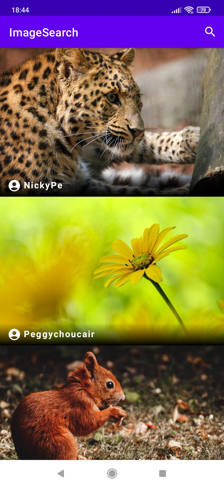
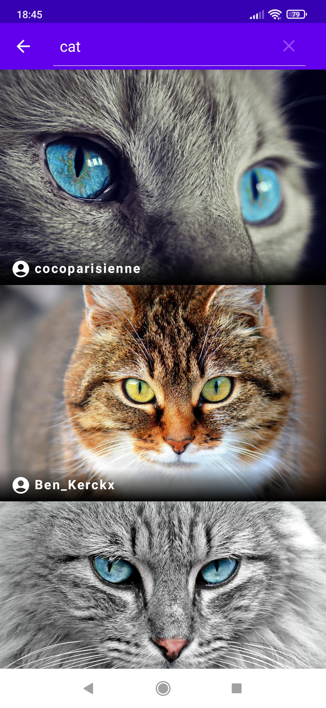

# Kotlin-Image-Search-App

Simple Image Search App Example With Kotlin

### With:
- `MVVM`
- `Live Data`
- `Data Binding`
- `Navigation Component`
- `Hilt`
- `Retrofit`
- `Coroutines`
- `Flow`
- `Paging`

### Screenshot

  </img>

  </img>
